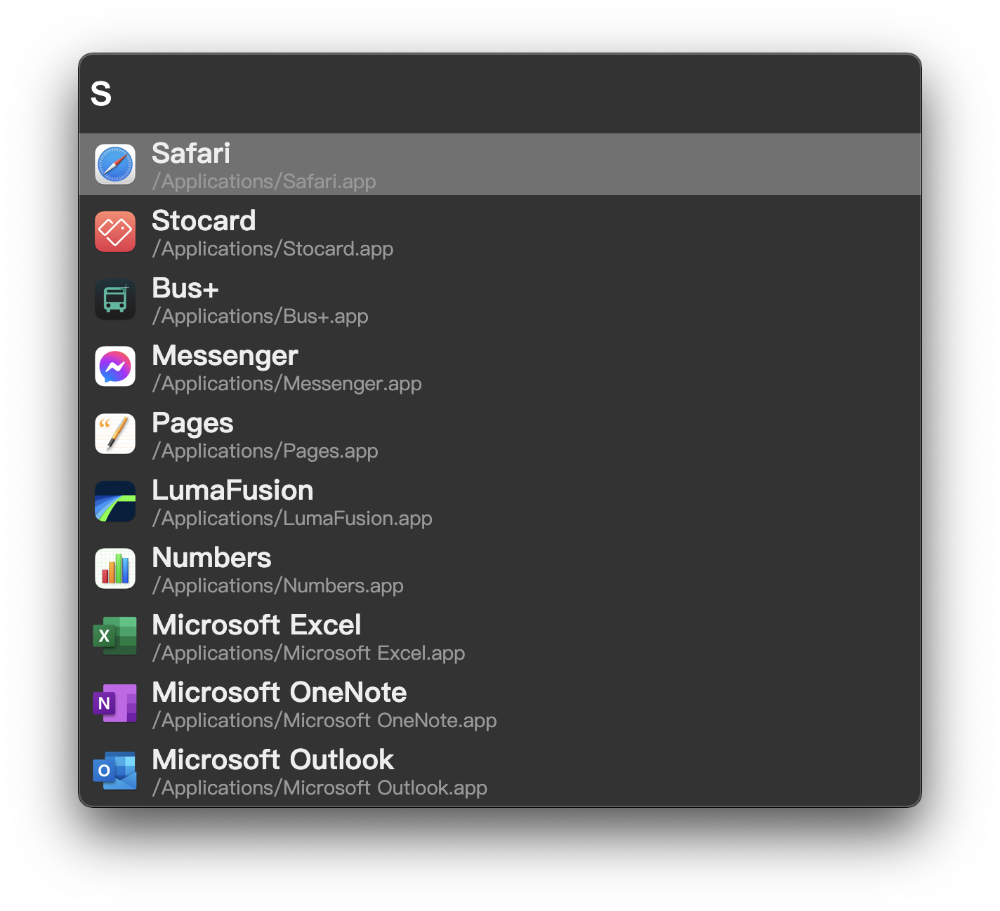

# Einstein :smirk_cat:

A completely reinvented cross-platform enthusiast-oriented `Spotlight` :mag:-like world-class productivity tool to optimize high-quality desktop experience and automation with excessively flexible community-driven plugin eco-system.



## Getting started

See build instructions below.

## Build

### Requirements

- [Node.js](https://nodejs.org/) >= `16.13.0`
- [npm](https://www.npmjs.com/) >= `8.0.0`

One can install `node` and `npm` via `nvm`.

```bash
nvm install 16.13.0
```

### Build and Run Einstein

```bash
# build the distributable electron application
npm install
npm run build

# wake up Einstein!
dist/electron/electron

# or use system provided electron binary
# electron dist/electron/resources/app/
# See: https://wiki.archlinux.org/index.php/Electron_package_guidelines
```

### npm scripts

- `build`: Build the distributable electron application under `dist/electron`
- `lint`: Run ESLint
- `format`: Run Prettier and ESLint to enforce coding style
- `run`: Bundle sources and run with electron
- `watch`: Watch and bundle sources
- `clean`: Clean up everything including `node_modules`

## Plugins

### Desktop Application Launcher

- support: Linux, macOS

Launch desktop applications in a snap!

### Pass password manager

- support: Linux, macOS

Plugin for [pass](https://www.passwordstore.org/) the standard UNIX password manager.

Synopsis:

```text
pass <filter>
pass show <filter>
```

### Example plugin

- this is not enabled

## License

See [LICENSE](/LICENSE) file

## See also

- [albert](https://github.com/albertlauncher/albert) (not a open source software)
- [Alfred](https://www.alfredapp.com/) (proprietary macOS only app)
- [core-js](https://github.com/zloirock/core-js) (MIT License)
- [Electron](https://www.electronjs.org/) (MIT License)
- [Fuse.js](https://fusejs.io/) (Apache License)
- [Vue.js](https://vuejs.org/) (MIT License)
