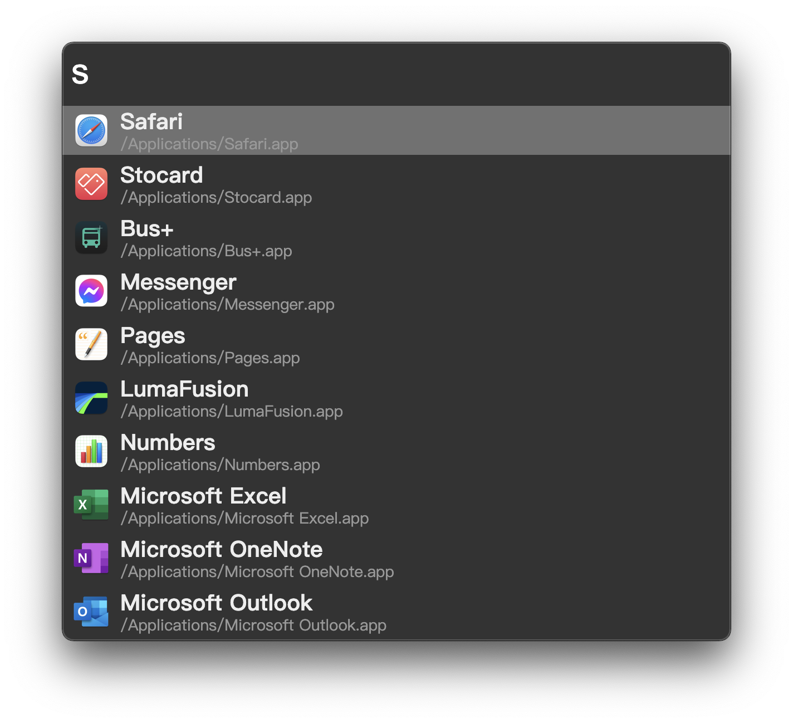

<!-- source-sha256: a9d006f02f44c04cfe38dd48a82756061ec4b2ad02f8e096dd6e0c6140695a69 -->

> 本文為 [README.md](README.md) 的翻譯，內容以英文版為準。

# Einstein :smirk_cat:

<p align="center">
<a href="https://github.com/ChildishGhost/einstein/blob/dev/.github/workflows/build.yaml"></a>
</p>

一個徹底重新發明、跨平台、為愛好者打造、類似 `Spotlight` :mag: 的世界級生產力工具，以極度彈性、由社群驅動的外掛生態系，最佳化高品質的桌面體驗與自動化。



## 快速開始

請參閱下方的建置說明。在 Linux 上，Einstein 也能在 Deno 上執行，並以 gpui-native 繪製原生 UI：請見 [Linux 上的 Einstein：Deno 與 gpui-native 技術堆疊](docs/linux-deno-stack.zh-tw.md)。

## 文件

- [Linux 上的 Einstein：Deno 與 gpui-native 技術堆疊](docs/linux-deno-stack.zh-tw.md)：需求、建置、全域快捷鍵、外掛、更新 gpui-native
- [RFC](docs/rfc/README.zh-tw.md)：設計決策與 RFC 流程

## 建置

### 需求

- [Node.js](https://nodejs.org/) >= `24.14.0`
- [npm](https://www.npmjs.com/) >= `9.0.0`

可透過 `nvm` 安裝 `node` 與 `npm`。

```bash
nvm install 24.14.0
```

### 建置並執行 Einstein（Electron）

```bash
# build the distributable electron application
npm install
npm run build

# wake up Einstein!
dist/electron/electron

# or use system provided electron binary
# electron dist/electron/resources/app/
# See: https://wiki.archlinux.org/index.php/Electron_package_guidelines
```

### npm 指令

- `build`：在 `dist/electron` 下建置可發行的 electron 應用程式
- `lint`：執行 ESLint
- `format`：執行 Prettier 與 ESLint 以統一程式碼風格
- `run`：打包原始碼並以 electron 執行
- `watch`：監看並打包原始碼
- `clean`：清除所有產物，包含 `node_modules`
- `test`：執行測試
- `docs:check`：依 [RFC 流程](docs/rfc/README.zh-tw.md) 檢查 RFC 與文件
- `docs:index`：重新產生 RFC 索引
- `rfc:new -- <kebab-title>`：從範本建立下一份 RFC 草稿
- `rfc:status -- <NNNN> <status>`：變更 RFC 狀態並更新索引

## 外掛

### 桌面應用程式啟動器

- 支援：Linux、macOS

瞬間啟動桌面應用程式！

### Pass 密碼管理器

- 支援：Linux、macOS

[pass](https://www.passwordstore.org/)（標準 UNIX 密碼管理器）的外掛。

用法：

```text
pass <filter>
pass show <filter>
```

### 範例外掛

- 預設未啟用

## 參與貢獻

決策（行為、介面、架構、重要的相依套件）從 RFC 開始：流程與索引請見 [docs/rfc](docs/rfc/README.zh-tw.md)。文件以英文撰寫，並附正體中文翻譯（`*.zh-tw.md`）。程式 agent 請遵循 [AGENTS.md](AGENTS.md)。

## 授權

請參閱 [LICENSE](/LICENSE) 檔案

## 另請參閱

- [albert](https://github.com/albertlauncher/albert)（非開源軟體）
- [Alfred](https://www.alfredapp.com/)（專有、僅限 macOS 的應用程式）
- [Electron](https://www.electronjs.org/)（MIT 授權）
- [Fuse.js](https://fusejs.io/)（Apache 授權）
- [Deno](https://deno.com/)（MIT 授權）
- [gpui-native](https://github.com/countradooku/gpui-native)（Apache 授權）
- [Vue.js](https://vuejs.org/)（MIT 授權）
